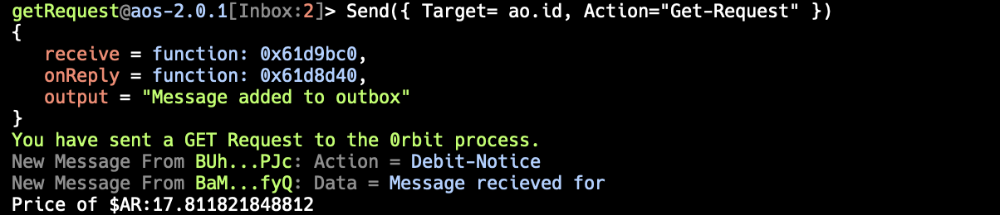

import { Callout, Steps } from 'nextra/components'

# First GET Request

In this tutorial, we will learn how to make a GET request on `0rbit` process. 

## 🔑 Prerequisites

- Understanding of the [ao](/concepts/what-is-ao) and [aos](/concepts/what-is-aos).
- aos installed on your system.
- Some $0RBT. _Learn how to get $0RBT [here](/protocol/token#how-to-get-0rbt)_
- Any Code Editor (VSCode, Sublime Text, etc)

If you are ready with the above prerequisites, 

## 🛠️ Let's Start Building 

### Initialize the Project

Create a new file named `0rbit-Get-Request.lua` in your project directory.

```bash
touch Get-Request.lua
```

### Initialize the Variables

```lua
local json = require("json")

_0RBIT = "BaMK1dfayo75s3q1ow6AO64UDpD9SEFbeE8xYrY2fyQ"
_0RBT_POINTS = "BUhZLMwQ6yZHguLtJYA5lLUa9LQzLXMXRfaq9FVcPJc"

FEE_AMOUNT = "1000000000000" -- 1 $0RBT
BASE_URL = "https://api.diadata.org/v1/assetQuotation/Arweave/0x0000000000000000000000000000000000000000"
``` 

### Make the Request

The following code contains the Handler that will send 1 $0RBT to the `0rbit` process and make the GET request for the `BASE_URL`

```lua
Handlers.add(
    "Get-Request",
    function(msg)
        Send({
            Target = _0RBT_POINTS,
            Action = "Transfer",
            Recipient = _0RBIT,
            Quantity = FEE_AMOUNT,
            ["X-Url"] = BASE_URL,
            ["X-Action"] = "Get-Real-Data"
        })
        print(Colors.green .. "You have sent a GET Request to the 0rbit process.")

        local res = Receive({Action = "Receive-Response"})
        local data = json.decode(res.Data)
        local price = data.Price
        print("Price of $AR:" .. price)
    end
)
```
Breakdown of the above code:
- `Handlers.add` is used to add a new handler to the `ao` process.
- __Get-Request__ is the name of the handler. It also act as an `Action` tag value by default.
- `function(msg)` is the function executed when the handler is called.
- `Send` is the function that takes several tags as the arguments and creates a message on the ao: 

    | __Tag__        | __Description__ |
    | :------------ | :---------: |
    | Target        |    The processId of the recipient. In this case, it's the $0RBT token processId.    |
    | Action     | The tag that defines the handler to be called in the recipient process. In this case it's `Transfer`   |
    | Recipient |     The tag that accepts the processId to whom the $0RBT will be sent. In this case, it's the 0rbit processId.        |
    | Quantity | The amount of $0RBT to be sent. |
    | ["X-Url"] | The _forwarded-tag_ which contains the URL and the same will be used by the __0rbit process__ to fetch the data. |
    | ["X-Action"] | The _forwarded-tag_ which contains the action to be performed by the __0rbit process__. In this case, it's __Get-Real-Data__. |
- `Receive` is use for Lua Coroutinesm, which acts as `await` in aos. So, till a message with `Action = "Receive-Response"` is not received it will not execute the complete code.
- `json.decode` is used to decode the JSON data received.


<Callout type="info" emoji="ℹ️">
    The 0rbit process always sends the data in the `string` format. 
    
    `json.decode` is used above because we know the receiving data, i.e., stringified JSON.
    
    So, you need to decode the data as per your requirements.
</Callout>

## 🏃 Run the process 

<Steps>
### Create a new process and load the script
```bash
aos getRequest --load Get-Request.lua
```
The above command will create a new process with the name __0rbitGetRequest__ and load `0rbit-Get-Request.lua` into it.

### Call the Handler 

    Call the handler, who will create a request for the 0rbit process.

    ```bash
    Send({ Target= ao.id, Action="Get-Request" })
    ```
    <details>
    <summary>
    Upon the successful execution, you will receive the following messages in your terminal
    </summary>
    
    </details>


</Steps>

---
___Voila! You have successfully made your first GET request on the 0rbit process. 🎉___

> You can find the complete code here:
> 
> https://github.com/0rbit-co/examples/blob/main/First-Get-Request.lua