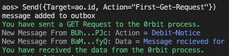

# Responses Received From 0rbit

During the process of getting the data from the internet, the 0rbit Network will send two types of messages to the `ao` process.


## Message Received Confirmation
After creating the request, the process will first receive a message confirming about the receiving of the request.

<details>
<summary>Example:</summary>
 
</details>

This message will contain the `RequestId` tag that represents the request you have made. You can use this `RequestId` to check map the responses with the requests.

<details>
<summary>Example Message Tags:</summary>
```json
Tags = {
    Pushed-For = "WfJaWyr9nx61_RhiHs-qKc8i_G-1l5n8K5ol0HRAvdM",
    From-Process = "BaMK1dfayo75s3q1ow6AO64UDpD9SEFbeE8xYrY2fyQ",
    RequestId = "6u09mK2UnqOcR4OJdfhdlPqF3J8FzpwuRYHG66W9yF0",
    Type = "Message",
    From-Module = "5l00H2S0RuPYe-V5GAI-1RgQEHFInSMr20E-3RNXJ_U",
    Data-Protocol = "ao",
    Ref_ = "68940",
    Variant = "ao.TN.1"
}
```
</details>
| __Tag__ | __Description__ | Value |
| --- | ----------- | ------- | 
| `RequestId` | The RequestId of the request. | MessageId of the request creation message. |

## Message Received with Data
Message received with data is the response from the 0rbit Network after fetching the data from the internet.

This message will contain several tags that will help you to understand the data and the request it is responding to.

<details>
<summary>Example Message Tags:</summary>
```json
Tags = {
    Status = "SUCCESS",
    Fee = "500000000000",
    SDK = "aoconnect",
    strict-transport-security = "max-age=15552000; includeSubDomains",
    x-content-type-options = "nosniff",
    RequestId = "6u09mK2UnqOcR4OJdfhdlPqF3J8FzpwuRYHG66W9yF0",
    transfer-encoding = "chunked",
    Pushed-For = "H9PPWuTHhrzpkycEqPgVABBuU-4izRGLfNenAldxW3k",
    From-Module = "5l00H2S0RuPYe-V5GAI-1RgQEHFInSMr20E-3RNXJ_U",
    date = "Wed, 10 Jul 2024 10:25:19 GMT",
    x-xss-protection = "1; mode=block",
    From-Process = "BaMK1dfayo75s3q1ow6AO64UDpD9SEFbeE8xYrY2fyQ",
    FeeUsed = "500000000000",
    Variant = "ao.TN.1",
    Type = "Message",
    access-control-allow-origin = "*",
    Data-Protocol = "ao",
    connection = "keep-alive",
    server = "Cowboy",
    etag = "W/"acf3-D4yhkvLTQv+3aQIytdEvzRbj4i4"",
    content-type = "application/json; charset=utf-8",
    Request-Type = "GET",
    Action = "Receive-Response",
    x-frame-options = "SAMEORIGIN",
    Ref_ = "68941",
    vary = "Accept-Encoding"
}
```
</details>

| __Tag__ | __Description__ | Value |
| --- | ----------- | ------- |
| `Action` | The name of the handler. | Receive-Response |
| `RequestId` | The RequestId of the request. | MessageId of the request creation message. |
| `Target` | The target of the response,i.e., your `ao` process | AO process Id|
| `Request-Type` | The type of request. | GET/POST |
| `Status` | The status of the request from the URL server. | SUCCESS/FAILED |
| `Fee` | The fee paid for the request. | |
| `FeeUsed` | The fee used for the request. ||

Apart from the above tags, the response will also include the HTTP headers received by the URL, like `content-type`, `server`, `date`, etc.